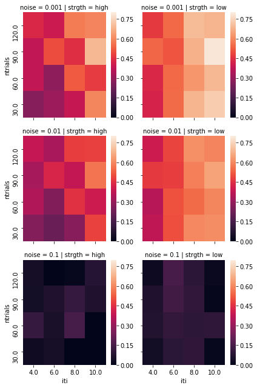
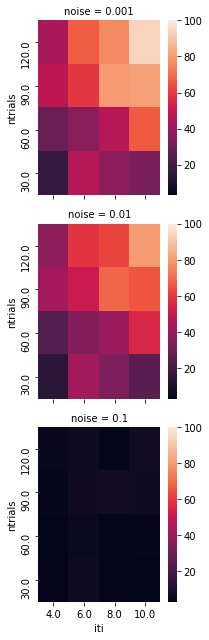
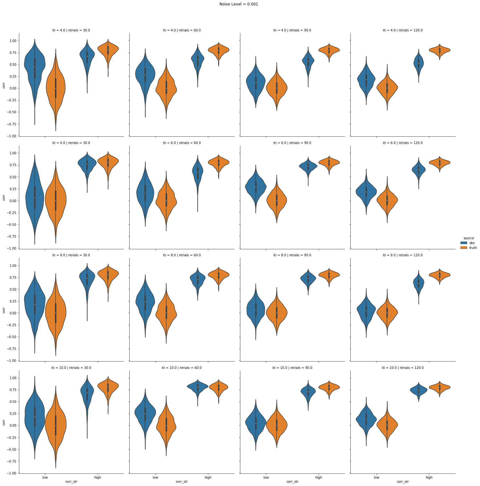
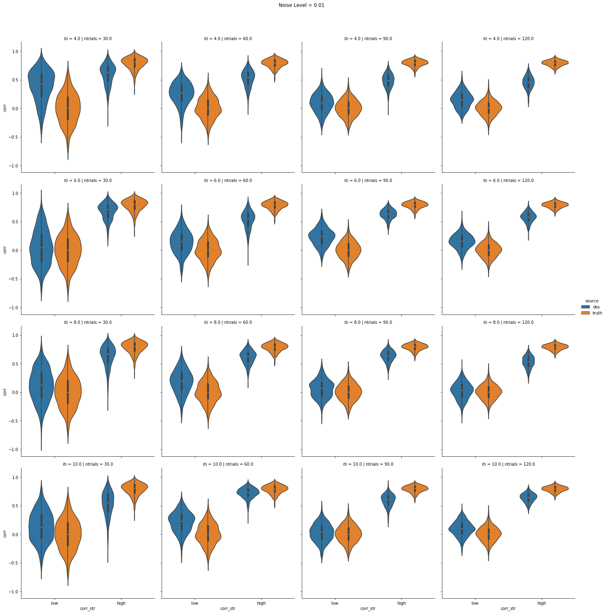
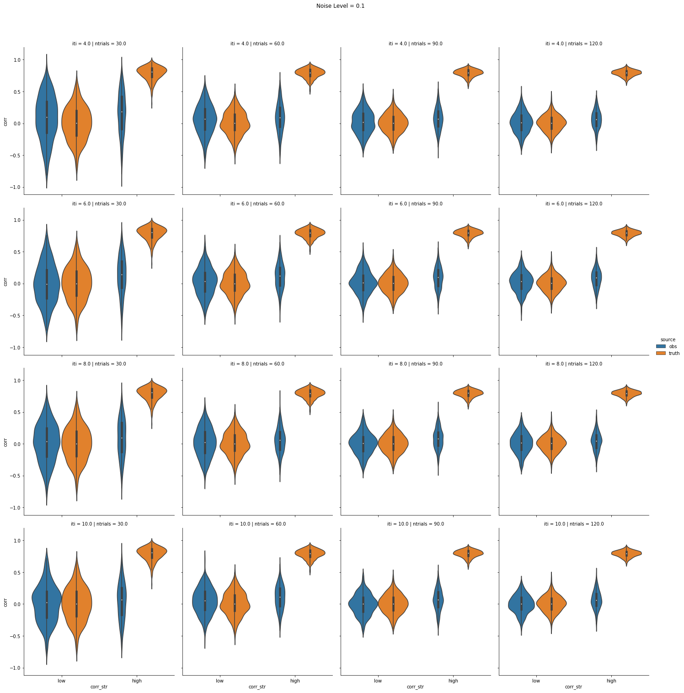

```python
%matplotlib inline
import pandas as pd
import numpy as np
import matplotlib.pyplot as plt
import seaborn as sns
from statsmodels.stats.weightstats import ttest_ind

import re
import os
from glob import glob
```


```python
data_dir = '../data/'
data_files = glob(os.path.join(data_dir, "iti-*_ntrials-*_noise-*_simulation.tsv"))
data_regex = re.compile(r".*?iti-(?P<iti>[0-9]+)_ntrials-(?P<ntrials>[0-9]+)_noise-(?P<noise>0.[0-9]+)_simulation.tsv")

df_collector = []
for dfile in data_files:
    mch = re.match(data_regex, dfile)
    attr_dict = mch.groupdict()
    
    df = pd.read_csv(dfile, sep='\t')
    nrows = len(df.index)
    
    df_dict = {k: [float(v)] * nrows for k,v in attr_dict.items()}
    
    df_add = pd.DataFrame.from_dict(df_dict)
    
    df_final = pd.concat([df, df_add], axis=1)
    
    df_collector.append(df_final)

    
    
```


```python
df_wide = pd.concat(df_collector, axis=0, ignore_index=True)
df_wide["id"] = df_wide.index
col_names = {"corr_ew": "corr_obs-low",
             "corr_dr": "corr_obs-high",
             "true_corr_dr": "corr_truth-high",
             "true_corr_ew": "corr_truth-low"}
df_wide.rename(col_names, axis=1, inplace=True)

# effect size for observed 0.8 - 0.0
df_wide['corr_obs-delta'] = df_wide['corr_obs-high'] - df_wide['corr_obs-low']
# effect size for ground truth 0.8 - 0.0
df_wide['corr_truth-delta'] = df_wide['corr_truth-high'] - df_wide['corr_truth-low']

# discrepency between truth and observed for low
df_wide['corr_disc-low'] = df_wide['corr_truth-low'] - df_wide['corr_obs-low']

# discrepency between truth and observed for high
df_wide['corr_disc-high'] = df_wide['corr_truth-high'] - df_wide['corr_obs-high']
df_wide.head()
```


<div>
<style scoped>
    .dataframe tbody tr th:only-of-type {
        vertical-align: middle;
    }

    .dataframe tbody tr th {
        vertical-align: top;
    }

    .dataframe thead th {
        text-align: right;
    }
</style>
<table border="1" class="dataframe">
  <thead>
    <tr style="text-align: right;">
      <th></th>
      <th>num</th>
      <th>corr_obs-low</th>
      <th>corr_truth-low</th>
      <th>corr_obs-high</th>
      <th>corr_truth-high</th>
      <th>snr</th>
      <th>iti</th>
      <th>ntrials</th>
      <th>noise</th>
      <th>id</th>
      <th>corr_obs-delta</th>
      <th>corr_truth-delta</th>
      <th>corr_disc-low</th>
      <th>corr_disc-high</th>
    </tr>
  </thead>
  <tbody>
    <tr>
      <th>0</th>
      <td>0</td>
      <td>-0.031667</td>
      <td>-0.044370</td>
      <td>0.061628</td>
      <td>0.735546</td>
      <td>1.428565</td>
      <td>10.0</td>
      <td>90.0</td>
      <td>0.1</td>
      <td>0</td>
      <td>0.093295</td>
      <td>0.779916</td>
      <td>-0.012704</td>
      <td>0.673918</td>
    </tr>
    <tr>
      <th>1</th>
      <td>1</td>
      <td>0.167236</td>
      <td>-0.382414</td>
      <td>-0.059141</td>
      <td>0.725196</td>
      <td>1.369580</td>
      <td>10.0</td>
      <td>90.0</td>
      <td>0.1</td>
      <td>1</td>
      <td>-0.226377</td>
      <td>1.107610</td>
      <td>-0.549650</td>
      <td>0.784337</td>
    </tr>
    <tr>
      <th>2</th>
      <td>2</td>
      <td>-0.021301</td>
      <td>0.155121</td>
      <td>0.111060</td>
      <td>0.654097</td>
      <td>1.441149</td>
      <td>10.0</td>
      <td>90.0</td>
      <td>0.1</td>
      <td>2</td>
      <td>0.132360</td>
      <td>0.498976</td>
      <td>0.176421</td>
      <td>0.543038</td>
    </tr>
    <tr>
      <th>3</th>
      <td>3</td>
      <td>0.015464</td>
      <td>0.212888</td>
      <td>0.185867</td>
      <td>0.596836</td>
      <td>1.263267</td>
      <td>10.0</td>
      <td>90.0</td>
      <td>0.1</td>
      <td>3</td>
      <td>0.170402</td>
      <td>0.383948</td>
      <td>0.197424</td>
      <td>0.410969</td>
    </tr>
    <tr>
      <th>4</th>
      <td>4</td>
      <td>-0.003093</td>
      <td>0.097607</td>
      <td>-0.019449</td>
      <td>0.848929</td>
      <td>1.498162</td>
      <td>10.0</td>
      <td>90.0</td>
      <td>0.1</td>
      <td>4</td>
      <td>-0.016356</td>
      <td>0.751322</td>
      <td>0.100700</td>
      <td>0.868378</td>
    </tr>
  </tbody>
</table>
</div>


```python
# list the variables in order
itis = df_wide.iti.unique()
itis.sort()
ntrials = df_wide.ntrials.unique()
ntrials.sort()
noises = df_wide.noise.unique()
noises.sort()
```


```python
# how well do the observed values correlate with the truth?
query = "noise == {noise} & iti == {iti} & ntrials == {ntrial}"
corr_dict = {'iti': [],
             'ntrials': [],
             'noise': [],
             'strgth': [],
             'corr': [],
             }
for iti in itis[1:]:
    for ntrial in ntrials:
        for noise in noises:
            for strgth in ["high", "low"]:
                rquery = query.format(iti=str(iti),
                                      ntrial=str(ntrial),
                                      noise=str(noise))
                tmp_df = df_wide.query(rquery)
                corr = np.corrcoef(tmp_df[['corr_truth-' + strgth, 'corr_obs-' + strgth]], rowvar=False)[0,1]
                tmp_df[['corr_truth-' + strgth, 'corr_obs-' + strgth]]
                print("iti: {iti}, ntrial: {ntrial}, noise: {noise}, str: {strgth} corr: {corr}".format(iti=str(iti), 
                                                                                                        ntrial=str(ntrial),
                                                                                                        noise=str(noise),
                                                                                                        corr=str(corr),
                                                                                                        strgth=strgth))
                corr_dict['iti'].append(iti)
                corr_dict['ntrials'].append(ntrial)
                corr_dict['noise'].append(noise)
                corr_dict['strgth'].append(strgth)
                corr_dict['corr'].append(corr)

df_corr = pd.DataFrame.from_dict(corr_dict)
df_corr.head()
```

    iti: 4.0, ntrial: 30.0, noise: 0.001, str: high corr: 0.27062975422262064
    iti: 4.0, ntrial: 30.0, noise: 0.001, str: low corr: 0.4221996706964973
    iti: 4.0, ntrial: 30.0, noise: 0.01, str: high corr: 0.2668318940522804
    iti: 4.0, ntrial: 30.0, noise: 0.01, str: low corr: 0.3760955251414892
    iti: 4.0, ntrial: 30.0, noise: 0.1, str: high corr: 0.03317385011057736
    iti: 4.0, ntrial: 30.0, noise: 0.1, str: low corr: 0.03909664693363392
    iti: 4.0, ntrial: 60.0, noise: 0.001, str: high corr: 0.3781751552018449
    iti: 4.0, ntrial: 60.0, noise: 0.001, str: low corr: 0.43645126478676394
    iti: 4.0, ntrial: 60.0, noise: 0.01, str: high corr: 0.3484420804994983
    iti: 4.0, ntrial: 60.0, noise: 0.01, str: low corr: 0.3597386624479271
    iti: 4.0, ntrial: 60.0, noise: 0.1, str: high corr: 0.11275267086003027
    iti: 4.0, ntrial: 60.0, noise: 0.1, str: low corr: 0.07252323705052183
    iti: 4.0, ntrial: 90.0, noise: 0.001, str: high corr: 0.3807362655103749
    iti: 4.0, ntrial: 90.0, noise: 0.001, str: low corr: 0.5408249146966717
    iti: 4.0, ntrial: 90.0, noise: 0.01, str: high corr: 0.33020357989507615
    iti: 4.0, ntrial: 90.0, noise: 0.01, str: low corr: 0.47061606478224016
    iti: 4.0, ntrial: 90.0, noise: 0.1, str: high corr: 0.042379908060872176
    iti: 4.0, ntrial: 90.0, noise: 0.1, str: low corr: 0.06695072936276553
    iti: 4.0, ntrial: 120.0, noise: 0.001, str: high corr: 0.43579759424005104
    iti: 4.0, ntrial: 120.0, noise: 0.001, str: low corr: 0.47175022783524545
    iti: 4.0, ntrial: 120.0, noise: 0.01, str: high corr: 0.3845605260312449
    iti: 4.0, ntrial: 120.0, noise: 0.01, str: low corr: 0.4002340113633783
    iti: 4.0, ntrial: 120.0, noise: 0.1, str: high corr: 0.0444966178154158
    iti: 4.0, ntrial: 120.0, noise: 0.1, str: low corr: 0.027376228987806332
    iti: 6.0, ntrial: 30.0, noise: 0.001, str: high corr: 0.3104098003460417
    iti: 6.0, ntrial: 30.0, noise: 0.001, str: low corr: 0.5523439372704808
    iti: 6.0, ntrial: 30.0, noise: 0.01, str: high corr: 0.21849523361898077
    iti: 6.0, ntrial: 30.0, noise: 0.01, str: low corr: 0.5032209870536927
    iti: 6.0, ntrial: 30.0, noise: 0.1, str: high corr: 0.04820916816389782
    iti: 6.0, ntrial: 30.0, noise: 0.1, str: low corr: 0.08762612076824818
    iti: 6.0, ntrial: 60.0, noise: 0.001, str: high corr: 0.2863225042661321
    iti: 6.0, ntrial: 60.0, noise: 0.001, str: low corr: 0.5487750317425921
    iti: 6.0, ntrial: 60.0, noise: 0.01, str: high corr: 0.25940050290887895
    iti: 6.0, ntrial: 60.0, noise: 0.01, str: low corr: 0.5101081716032903
    iti: 6.0, ntrial: 60.0, noise: 0.1, str: high corr: 0.05623344051722677
    iti: 6.0, ntrial: 60.0, noise: 0.1, str: low corr: 0.1082373083409282
    iti: 6.0, ntrial: 90.0, noise: 0.001, str: high corr: 0.5002720631236751
    iti: 6.0, ntrial: 90.0, noise: 0.001, str: low corr: 0.5134108315299939
    iti: 6.0, ntrial: 90.0, noise: 0.01, str: high corr: 0.4301550950480817
    iti: 6.0, ntrial: 90.0, noise: 0.01, str: low corr: 0.47560903077651534
    iti: 6.0, ntrial: 90.0, noise: 0.1, str: high corr: 0.06840808670210123
    iti: 6.0, ntrial: 90.0, noise: 0.1, str: low corr: 0.13850860438344395
    iti: 6.0, ntrial: 120.0, noise: 0.001, str: high corr: 0.39854032094776826
    iti: 6.0, ntrial: 120.0, noise: 0.001, str: low corr: 0.547846643167884
    iti: 6.0, ntrial: 120.0, noise: 0.01, str: high corr: 0.33408746561321306
    iti: 6.0, ntrial: 120.0, noise: 0.01, str: low corr: 0.4900240755373263
    iti: 6.0, ntrial: 120.0, noise: 0.1, str: high corr: -0.03225136206627404
    iti: 6.0, ntrial: 120.0, noise: 0.1, str: low corr: 0.15071824425750366
    iti: 8.0, ntrial: 30.0, noise: 0.001, str: high corr: 0.3885253788967524
    iti: 8.0, ntrial: 30.0, noise: 0.001, str: low corr: 0.68743613245309
    iti: 8.0, ntrial: 30.0, noise: 0.01, str: high corr: 0.2741569586138988
    iti: 8.0, ntrial: 30.0, noise: 0.01, str: low corr: 0.6019012811075125
    iti: 8.0, ntrial: 30.0, noise: 0.1, str: high corr: -0.04742339686129157
    iti: 8.0, ntrial: 30.0, noise: 0.1, str: low corr: 0.10153652617391465
    iti: 8.0, ntrial: 60.0, noise: 0.001, str: high corr: 0.5220507062471043
    iti: 8.0, ntrial: 60.0, noise: 0.001, str: low corr: 0.6257281113817
    iti: 8.0, ntrial: 60.0, noise: 0.01, str: high corr: 0.45348761311567376
    iti: 8.0, ntrial: 60.0, noise: 0.01, str: low corr: 0.5524897271529421
    iti: 8.0, ntrial: 60.0, noise: 0.1, str: high corr: 0.14921909998474073
    iti: 8.0, ntrial: 60.0, noise: 0.1, str: low corr: 0.09518655226609894
    iti: 8.0, ntrial: 90.0, noise: 0.001, str: high corr: 0.4498669487394946
    iti: 8.0, ntrial: 90.0, noise: 0.001, str: low corr: 0.6786235438029954
    iti: 8.0, ntrial: 90.0, noise: 0.01, str: high corr: 0.38153278425408665
    iti: 8.0, ntrial: 90.0, noise: 0.01, str: low corr: 0.5847989117729256
    iti: 8.0, ntrial: 90.0, noise: 0.1, str: high corr: 0.11425770912190672
    iti: 8.0, ntrial: 90.0, noise: 0.1, str: low corr: 0.10495063515091009
    iti: 8.0, ntrial: 120.0, noise: 0.001, str: high corr: 0.5806164548709114
    iti: 8.0, ntrial: 120.0, noise: 0.001, str: low corr: 0.6992835301009673
    iti: 8.0, ntrial: 120.0, noise: 0.01, str: high corr: 0.47599151593891065
    iti: 8.0, ntrial: 120.0, noise: 0.01, str: low corr: 0.614467472173318
    iti: 8.0, ntrial: 120.0, noise: 0.1, str: high corr: 0.013202460626946369
    iti: 8.0, ntrial: 120.0, noise: 0.1, str: low corr: 0.09160272201027206
    iti: 10.0, ntrial: 30.0, noise: 0.001, str: high corr: 0.5991898795031159
    iti: 10.0, ntrial: 30.0, noise: 0.001, str: low corr: 0.7320247488153375
    iti: 10.0, ntrial: 30.0, noise: 0.01, str: high corr: 0.4869079682914977
    iti: 10.0, ntrial: 30.0, noise: 0.01, str: low corr: 0.610749965580861
    iti: 10.0, ntrial: 30.0, noise: 0.1, str: high corr: -0.0052115570341903705
    iti: 10.0, ntrial: 30.0, noise: 0.1, str: low corr: 0.015235731403841189
    iti: 10.0, ntrial: 60.0, noise: 0.001, str: high corr: 0.4743116355121079
    iti: 10.0, ntrial: 60.0, noise: 0.001, str: low corr: 0.6916555619567676
    iti: 10.0, ntrial: 60.0, noise: 0.01, str: high corr: 0.4021232922678589
    iti: 10.0, ntrial: 60.0, noise: 0.01, str: low corr: 0.5991636449925111
    iti: 10.0, ntrial: 60.0, noise: 0.1, str: high corr: -0.015037906113934258
    iti: 10.0, ntrial: 60.0, noise: 0.1, str: low corr: 0.0990559300043827
    iti: 10.0, ntrial: 90.0, noise: 0.001, str: high corr: 0.6932934940459394
    iti: 10.0, ntrial: 90.0, noise: 0.001, str: low corr: 0.7879434641266765
    iti: 10.0, ntrial: 90.0, noise: 0.01, str: high corr: 0.5660895437636708
    iti: 10.0, ntrial: 90.0, noise: 0.01, str: low corr: 0.6500384230225479
    iti: 10.0, ntrial: 90.0, noise: 0.1, str: high corr: 0.06620486011239722
    iti: 10.0, ntrial: 90.0, noise: 0.1, str: low corr: 0.011884872800676245
    iti: 10.0, ntrial: 120.0, noise: 0.001, str: high corr: 0.5967402848050507
    iti: 10.0, ntrial: 120.0, noise: 0.001, str: low corr: 0.6861206800950204
    iti: 10.0, ntrial: 120.0, noise: 0.01, str: high corr: 0.4812041973807355
    iti: 10.0, ntrial: 120.0, noise: 0.01, str: low corr: 0.5963257952506648
    iti: 10.0, ntrial: 120.0, noise: 0.1, str: high corr: 0.07930482231102905
    iti: 10.0, ntrial: 120.0, noise: 0.1, str: low corr: 0.019532039660376064


<div>
<style scoped>
    .dataframe tbody tr th:only-of-type {
        vertical-align: middle;
    }

    .dataframe tbody tr th {
        vertical-align: top;
    }

    .dataframe thead th {
        text-align: right;
    }
</style>
<table border="1" class="dataframe">
  <thead>
    <tr style="text-align: right;">
      <th></th>
      <th>iti</th>
      <th>ntrials</th>
      <th>noise</th>
      <th>strgth</th>
      <th>corr</th>
    </tr>
  </thead>
  <tbody>
    <tr>
      <th>0</th>
      <td>4.0</td>
      <td>30.0</td>
      <td>0.001</td>
      <td>high</td>
      <td>0.270630</td>
    </tr>
    <tr>
      <th>1</th>
      <td>4.0</td>
      <td>30.0</td>
      <td>0.001</td>
      <td>low</td>
      <td>0.422200</td>
    </tr>
    <tr>
      <th>2</th>
      <td>4.0</td>
      <td>30.0</td>
      <td>0.010</td>
      <td>high</td>
      <td>0.266832</td>
    </tr>
    <tr>
      <th>3</th>
      <td>4.0</td>
      <td>30.0</td>
      <td>0.010</td>
      <td>low</td>
      <td>0.376096</td>
    </tr>
    <tr>
      <th>4</th>
      <td>4.0</td>
      <td>30.0</td>
      <td>0.100</td>
      <td>high</td>
      <td>0.033174</td>
    </tr>
  </tbody>
</table>
</div>


```python
# show how well the observed correlations "correlate" with the ground truth correlations
def draw_heatmap(*args, **kwargs):
    data = kwargs.pop('data')
    d = data.pivot(index=args[1], columns=args[0], values=args[2])
    d = d[::-1]
    sns.heatmap(d, **kwargs)

fg = sns.FacetGrid(df_corr, col='strgth', row='noise')
fg.map_dataframe(draw_heatmap, 'iti', 'ntrials', 'corr', vmin=0, vmax=0.8)
```


    <seaborn.axisgrid.FacetGrid at 0x7f5d139f09e8>





```python
ttest_dict = {
    'p_value': [],
    't_value': [],
    'source': [],
    'iti': [],
    'ntrials': [],
    'noise': [],
    'df': [],
}

for iti in itis[1:]:
    for ntrial in ntrials:
        for noise in noises:
            rquery = query.format(iti=str(iti),
                                      ntrial=str(ntrial),
                                      noise=str(noise))
            tmp_df = df_wide.query(rquery)
            for source in ["truth", "obs"]:
                t_val, p_val, deg_f = ttest_ind(tmp_df["corr_{src}-high".format(src=source)],
                                            tmp_df["corr_{src}-low".format(src=source)])
                
                ttest_dict['iti'].append(iti)
                ttest_dict['ntrials'].append(ntrial)
                ttest_dict['noise'].append(noise)
                ttest_dict['p_value'].append(p_val)
                ttest_dict['t_value'].append(t_val)
                ttest_dict['df'].append(deg_f)
                ttest_dict['source'].append(source)

ttest_df = pd.DataFrame.from_dict(ttest_dict)
ttest_df.head()
                
```


<div>
<style scoped>
    .dataframe tbody tr th:only-of-type {
        vertical-align: middle;
    }

    .dataframe tbody tr th {
        vertical-align: top;
    }

    .dataframe thead th {
        text-align: right;
    }
</style>
<table border="1" class="dataframe">
  <thead>
    <tr style="text-align: right;">
      <th></th>
      <th>p_value</th>
      <th>t_value</th>
      <th>source</th>
      <th>iti</th>
      <th>ntrials</th>
      <th>noise</th>
      <th>df</th>
    </tr>
  </thead>
  <tbody>
    <tr>
      <th>0</th>
      <td>0.000000e+00</td>
      <td>61.802717</td>
      <td>truth</td>
      <td>4.0</td>
      <td>30.0</td>
      <td>0.001</td>
      <td>998.0</td>
    </tr>
    <tr>
      <th>1</th>
      <td>1.779914e-56</td>
      <td>16.888598</td>
      <td>obs</td>
      <td>4.0</td>
      <td>30.0</td>
      <td>0.001</td>
      <td>998.0</td>
    </tr>
    <tr>
      <th>2</th>
      <td>0.000000e+00</td>
      <td>61.802717</td>
      <td>truth</td>
      <td>4.0</td>
      <td>30.0</td>
      <td>0.010</td>
      <td>998.0</td>
    </tr>
    <tr>
      <th>3</th>
      <td>1.767587e-39</td>
      <td>13.741156</td>
      <td>obs</td>
      <td>4.0</td>
      <td>30.0</td>
      <td>0.010</td>
      <td>998.0</td>
    </tr>
    <tr>
      <th>4</th>
      <td>0.000000e+00</td>
      <td>61.802717</td>
      <td>truth</td>
      <td>4.0</td>
      <td>30.0</td>
      <td>0.100</td>
      <td>998.0</td>
    </tr>
  </tbody>
</table>
</div>


```python
# show how t-values are modulated by trial number and iti
ttest_filt_df = ttest_df.query("source == 'obs'")

fg = sns.FacetGrid(ttest_filt_df, row='noise')
fg.map_dataframe(draw_heatmap, 'iti', 'ntrials', 't_value', vmin=3, vmax=100)
```


    <seaborn.axisgrid.FacetGrid at 0x7f5d0c066908>





```python
# make the correlations in one column
# ew = 0.0, dr = 0.8 (corr_str)
# (corr_ew, corr_dr) = observed, (true_corr_ew, true_corr_dr) = truth

df_long = pd.wide_to_long(df_wide, stubnames='corr', i='id', j="source-corr_str", sep="_", suffix="\\D+")
# id and source-corr_str became a part of the index
df_long.reset_index(inplace=True)
# split the source-corr_str columns
df_long[['source','corr_str']] = df_long['source-corr_str'].str.split("-",expand=True,)
# drop the no longer necessary columns
df_long.drop(labels=["id", "source-corr_str"], axis=1, inplace=True)
df_long.head()
```


<div>
<style scoped>
    .dataframe tbody tr th:only-of-type {
        vertical-align: middle;
    }

    .dataframe tbody tr th {
        vertical-align: top;
    }

    .dataframe thead th {
        text-align: right;
    }
</style>
<table border="1" class="dataframe">
  <thead>
    <tr style="text-align: right;">
      <th></th>
      <th>iti</th>
      <th>num</th>
      <th>ntrials</th>
      <th>noise</th>
      <th>snr</th>
      <th>corr</th>
      <th>source</th>
      <th>corr_str</th>
    </tr>
  </thead>
  <tbody>
    <tr>
      <th>0</th>
      <td>10.0</td>
      <td>0</td>
      <td>90.0</td>
      <td>0.1</td>
      <td>1.428565</td>
      <td>-0.031667</td>
      <td>obs</td>
      <td>low</td>
    </tr>
    <tr>
      <th>1</th>
      <td>10.0</td>
      <td>1</td>
      <td>90.0</td>
      <td>0.1</td>
      <td>1.369580</td>
      <td>0.167236</td>
      <td>obs</td>
      <td>low</td>
    </tr>
    <tr>
      <th>2</th>
      <td>10.0</td>
      <td>2</td>
      <td>90.0</td>
      <td>0.1</td>
      <td>1.441149</td>
      <td>-0.021301</td>
      <td>obs</td>
      <td>low</td>
    </tr>
    <tr>
      <th>3</th>
      <td>10.0</td>
      <td>3</td>
      <td>90.0</td>
      <td>0.1</td>
      <td>1.263267</td>
      <td>0.015464</td>
      <td>obs</td>
      <td>low</td>
    </tr>
    <tr>
      <th>4</th>
      <td>10.0</td>
      <td>4</td>
      <td>90.0</td>
      <td>0.1</td>
      <td>1.498162</td>
      <td>-0.003093</td>
      <td>obs</td>
      <td>low</td>
    </tr>
  </tbody>
</table>
</div>


```python
df_long_raw = df_long.query("corr_str != 'delta' & source != 'disc'")
df_long_deriv = df_long.query("corr_str == 'delta' & source == 'disc'")
```


```python
# show the average correlations across different conditions
for noise in noises:
    g = sns.catplot(x="corr_str", y="corr", hue="source",
                    row="iti", row_order=itis[1:],
                    col="ntrials", col_order=ntrials,
                    kind="violin", data=df_long_raw.query('noise == {noise} & iti != 2.'.format(noise=noise)))
    g.fig.suptitle('Noise Level = {noise}'.format(noise=noise), y=1.05)
    plt.show()
```











```python


```
